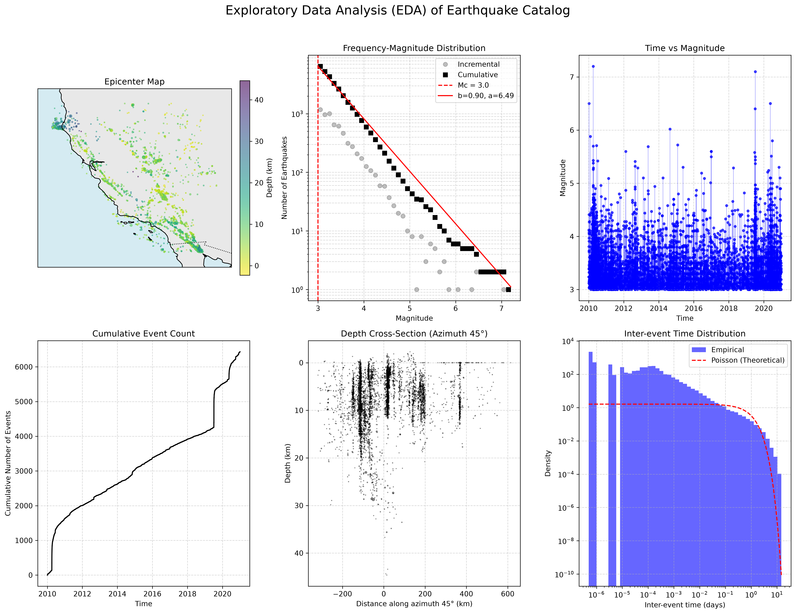

# Phase 3: Exploratory Data Analysis (EDA) Views

This document reproduces and interprets the three canonical EDA views (from CORSSA theme-3) for the California catalog (2010-2020).

## 1. Frequency-Magnitude Distribution (FMD)

*(See the top-middle panel of the EDA figure)*

**Interpretation:**
The FMD shows the Gutenberg-Richter scaling law. The solid black squares represent the cumulative number of events with magnitude $\ge M$, while the grey circles represent the incremental count per magnitude bin. 
- At smaller magnitudes, the data deviates from the linear Gutenberg-Richter fit due to network incompleteness (events are too small to be reliably detected).
- The red dashed line marks the Magnitude of Completeness ($M_c$). Above $M_c$, the distribution follows a straight line in log-space.
- The slope of this line is the $b$-value (typically near 1.0 for tectonic regions), representing the ratio of small to large earthquakes. The $a$-value represents the overall seismic productivity.

## 2. Epicenter Map
*(See the top-left panel of the EDA figure)*

**Interpretation:**
The epicenter map visualizes the spatial clustering of earthquakes. 
- The map reveals clear lineations and dense clusters that correspond to major fault zones in California (e.g., the San Andreas fault system).
- Marker size scales with magnitude, highlighting the locations of mainshocks.
- Color scales with depth, allowing us to identify structural features like shallow crustal faults or deeper subduction zones (though California is predominantly shallow transform faulting).

## 3. Time-Magnitude View
*(See the top-right panel of the EDA figure)*

**Interpretation:**
The time-magnitude stem plot shows the temporal occurrence of earthquakes.
- We observe a dense background rate of smaller earthquakes interspersed with vertical "spikes" denoting mainshocks.
- Following major mainshocks, dense clusters of points appear. These are aftershock sequences (Omori's Law decay).
- The visual density of these aftershocks heavily motivates the Epidemic-Type Aftershock Sequence (ETAS) model, as it is immediately apparent that earthquakes are not a uniform Poisson process in time, but strongly cluster and trigger one another.
